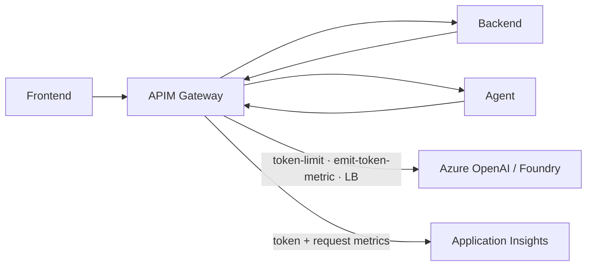

# Contribution 1 — Wire Agent Traffic Through the APIM GenAI Gateway

> **Est. effort:** TBD · **Type:** Reference-implementation enhancement · **Area:** `resources/agent-workload/`

---

> **Planning note (our notepad).**
> This is **not** an attendee challenge yet — it's a working design note for a contribution we intend to
> upstream. It captures the problem, the target state, and the tasks so we don't lose the thread. Once
> it's real and reviewed, it can graduate into proper `challenges/` + `coach/` content.

## The problem we're fixing

In the current reference implementation, **API Management is deployed but inert** — nothing actually
routes through it:

- **Frontend → Backend** goes straight to the backend Container App FQDN (`NEXT_PUBLIC_API_URL`).
- **Backend → Agent** goes straight to the agent Container App FQDN (`AGENT_SERVICE_URL`).
- **Agent → Azure OpenAI/Foundry** calls the Cognitive Services endpoint directly (`AZURE_OPENAI_ENDPOINT`).
- APIM's gateway URL only appears as a Bicep **output** (`AZURE_APIM_GATEWAY_URL`) and is **consumed by nobody**.

The README *claims* APIM provides "PTU-aware load balancing, rate limiting, and centralized analytics,"
but none of those policies are wired. So APIM is dead weight that complicates the diagram without doing
any work — and, more importantly, we're missing a first-class **cost/usage telemetry source** that the
Fabric Control Tower would love to consume.

## Objectives

- Route model-bound traffic through APIM as a **GenAI gateway** instead of calling Azure OpenAI directly.
- Emit **token/cost metrics** at the gateway (`emit-token-metric`) as a clean signal for the Control Tower.
- Add **token-based rate limiting** (`azure-openai-token-limit`) as the enforcement point Contribution 2 will actuate.
- (Optional) Demonstrate **load balancing / spillover** across more than one model deployment.
- Keep the existing "custom agent" story intact — this is about making the gateway real, not replacing services.

## Target state

## Scope / tasks

1. **Add an Azure OpenAI API to APIM** (currently only `frontend-api`, `backend-api`, `agent-api` exist).
   - Import the AOAI REST surface, point the backend at the model deployment(s).
2. **Attach GenAI policies** to that API:
   - `emit-token-metric` → App Insights (prompt/completion/total tokens, model, caller dimension).
   - `azure-openai-token-limit` → per-subscription/product token quota (the lever for Contribution 2).
   - (Optional) `set-backend-service` + backend pool for PTU/pay-go **load balancing / spillover**.
3. **Repoint the agent** to call the model **via APIM** (`AZURE_OPENAI_ENDPOINT` → APIM gateway route),
   passing the subscription key / managed-identity auth as required.
4. **(Optional) Repoint east-west ingress** (frontend→backend, backend→agent) through APIM if we decide
   north-south routing is worth the latency; otherwise document why east-west stays internal.
5. **Wire APIM diagnostics** to Log Analytics / App Insights so gateway analytics land in the landing zone.
6. **Update docs**: fix the README's APIM claims to match what's actually implemented.

## Success criteria

- [ ] A model call made by the agent is observable **passing through APIM** (APIM analytics shows it).
- [ ] Token metrics appear in App Insights emitted **by the gateway**, not just parsed from app traces.
- [ ] A token-limit policy is enforceable and demonstrably throttles when exceeded.
- [ ] `AZURE_APIM_GATEWAY_URL` is actually consumed by a caller (no longer a dangling output).
- [ ] README/architecture docs reflect reality (no more aspirational-only claims).

## Open questions / decisions

- Do we route **east-west** traffic through APIM too, or keep the gateway to the **model hop** only?
  (Leaning: model hop first — highest value, lowest blast radius.)
- Auth model to AOAI via APIM: **managed identity pass-through** vs. APIM-held credential.
- Which challenge does this land in? Likely an enhancement to **Challenge 1** (source) and a mention in
  **Challenge 2** (landing zone gets a new telemetry stream).
- Consumption SKU APIM limits — confirm `emit-token-metric` + token-limit policies are supported on it.

## How this connects to Contribution 2

This contribution is the **enabler**. Once model traffic flows through APIM and there's a real
`azure-openai-token-limit` policy in place, the Control Tower can *actuate* it — see
[Contribution 2 — Close the Loop](contribution-02-control-tower-actuation.md).

## Resources

- Reference component: [`resources/agent-workload/`](../resources/agent-workload/README.md)
- APIM module today: [`resources/agent-workload/infra/modules/api-management.bicep`](../resources/agent-workload/infra/modules/api-management.bicep)
- Agent service: [`resources/agent-workload/src/agent/app.py`](../resources/agent-workload/src/agent/app.py)
- Architecture: [`docs/architecture.md`](../docs/architecture.md)

---

➡️ Next: [Contribution 2 — Close the Loop: Control Tower Actuation](contribution-02-control-tower-actuation.md)
