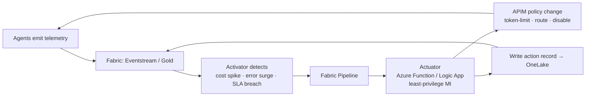

# Contribution 2 — Close the Loop: Control Tower Actuation

> **Est. effort:** TBD · **Type:** Stretch capability (Challenge 6 extension) · **Area:** `resources/fabric-control-tower/` + `resources/agent-workload/`

---

> **Planning note (our notepad).**
> Working design note for our second contribution. Goal: make the Control Tower a **true control plane** —
> a single place to not just *watch* the agentic estate but *act* on it. Not attendee-ready yet.

## The idea

Today the Control Tower stops at **observe** (dashboards) and, in Challenge 6, **alert**. This contribution
adds the missing verbs — **decide → act → verify** — so the platform can respond to problems automatically:

> When reliability slips, cost spikes, or an agent misbehaves, Fabric detects it and drives a change in
> **APIM** (the choke point from Contribution 1) to protect the estate — then records what it did.

This is what turns "AgentOps as monitoring" into "AgentOps as operations."

## Objectives

- Detect a meaningful condition in Fabric (**Activator** on real-time or Gold data).
- Trigger a **Fabric pipeline** that invokes an **actuator** to change an **APIM policy**.
- Apply a safe, reversible control action (e.g. tighten a token limit for one team).
- **Write the action back into OneLake** so interventions become telemetry too.
- Prove the loop closes: breach → action → metric responds → action recorded.

## Target architecture

Key principle: **Fabric is the brain, not the hands.** Data Activator cannot (and should not) call ARM/APIM
directly, so a dedicated **actuator** (Function or Logic App with its own scoped managed identity) applies
the change. Fabric emits *intent*; the actuator enforces it.

## Control levers (map signal → action)

| Signal (from Gold / real-time) | APIM action |
|---|---|
| Team blows its token budget | Tighten `azure-openai-token-limit` for that product/subscription |
| Agent floods errors / runaway loop | Rate-limit or temporarily block its subscription key |
| Model deployment degrades (latency/5xx) | Switch backend pool → route to a healthy deployment |
| Global cost ceiling hit | Lower `max-tokens` / force a cheaper model tier |

## Reference vertical slice (build this one end-to-end first)

> **Cost-overrun → Activator → Pipeline → Function → tighten APIM token-limit for that team → write
> action back to OneLake → dashboard shows the intervention.**

One clean slice proves the pattern and gives contributors a template to add more levers. Do **not** try to
build the whole matrix at once.

## Guardrails (the stuff that makes it trustworthy)

- **Human-in-the-loop tiering** — notify/recommend for everything; auto-remediate only low-risk, reversible
  actions; require approval (Teams adaptive card / Power Automate) for anything destructive.
- **Prevent flapping** — hysteresis + cooldown windows + state tracking so it doesn't oscillate.
- **Least privilege** — actuator identity scoped to *specific* APIM operations only.
- **Audit / close the loop** — every automated change written to OneLake as an event, so the tower shows
  "what we did and whether it worked," not just "what happened."
- **Config drift** — Fabric mutating APIM at runtime conflicts with the Bicep IaC source of truth. Decide
  reconciliation up front (store desired policy state as data / reflect back to Git), don't silently diverge.

## Scope / tasks

1. **Detection** — define the Activator rule on a real-time source (Eventstream/Eventhouse) or Gold measure.
2. **Trigger** — Activator → run a **Fabric pipeline** (`resources/fabric-control-tower/fabric/pipelines/`).
3. **Actuator** — build a **Function/Logic App** that calls the APIM management API to update the policy.
4. **Action** — implement the token-limit tightening for a target team/subscription.
5. **Write-back** — land an "intervention" record in OneLake (new Bronze/Silver table + Gold rollup).
6. **Visualize** — add an "Actions taken" tile to the Control Tower dashboard.
7. **Docs** — extend **Challenge 6** (attendee) + matching **coach guide** with this as an optional path.

## Success criteria

- [ ] A simulated breach fires the Activator rule.
- [ ] The pipeline runs and the actuator changes a real APIM policy (verifiable in APIM).
- [ ] The affected traffic is measurably throttled/rerouted afterward.
- [ ] The intervention is recorded in OneLake and surfaces on a dashboard.
- [ ] Guardrails documented (approval tier + cooldown + drift reconciliation).

## Open questions / decisions

- Real-time path (Eventstream/Eventhouse → Activator) vs. batch Gold — likely **real-time for actuation,
  batch for reporting**. Confirm latency needs.
- Actuator: **Azure Function** vs. **Logic App** — which is easier to ship as reference IaC?
- How much to automate vs. approve for the RVAS demo (probably: demo auto for token-limit, approval for disable).
- Drift model: config-as-data applied by actuator, or accept GitOps divergence with a reconcile job?

## Depends on

- [Contribution 1 — Wire Agent Traffic Through the APIM GenAI Gateway](contribution-01-apim-gateway.md)
  (must land first: no controllable choke point without it).

## Resources

- Fabric control tower: [`resources/fabric-control-tower/`](../resources/fabric-control-tower/README.md)
- Challenge 6 (extend this): [`challenges/challenge-06-operationalize.md`](challenge-06-operationalize.md)
- Coach guide 6: [`coach/challenge-06-guide.md`](../coach/challenge-06-guide.md)
- APIM module: [`resources/agent-workload/infra/modules/api-management.bicep`](../resources/agent-workload/infra/modules/api-management.bicep)

---

⬅️ Previous: [Contribution 1 — APIM GenAI Gateway](contribution-01-apim-gateway.md)
